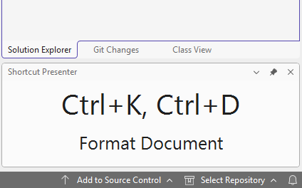
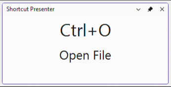
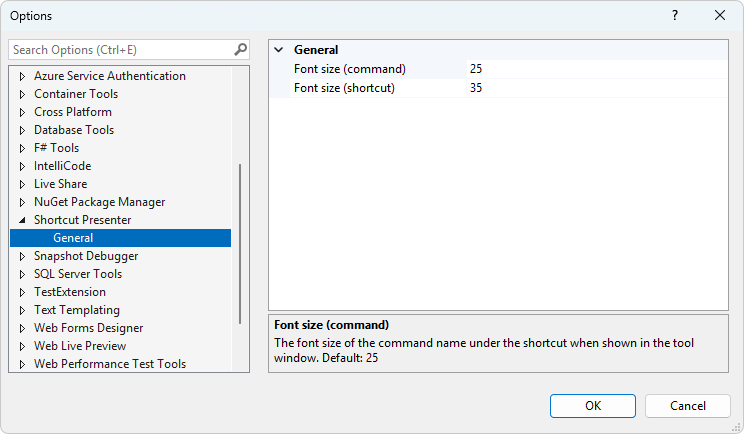

[marketplace]: https://marketplace.visualstudio.com/items?itemName=MadsKristensen.ShortcutPresenter
[vsixgallery]: http://vsixgallery.com/extension/ShortcutWindow.d11ce83f-99f9-41f5-8c58-9e5c4286fd2c
[repo]:https://github.com/madskristensen/ShortcutWindow

# Shortcut Presenter for Visual Studio

Download this extension from the [Visual Studio Marketplace][marketplace]
or get the [CI build][vsixgallery]

----------------------------------------

Shows what keyboard shortcuts are being used in the corner of the screen. Great for presentations and demos.

You can pause an play by hovering the mouse over the window and clicking the play/pause button.

To change the font size, use the options dialog to make adjustments.

## How can I help?
If you enjoy using the extension, please give it a ★★★★★ rating on the [Visual Studio Marketplace][marketplace].

Should you encounter bugs or if you have feature requests, head on over to the [GitHub repo][repo] to open an issue if one doesn't already exist.

Pull requests are also very welcome, since I can't always get around to fixing all bugs myself. This is a personal passion project, so my time is limited.

Another way to help out is to [sponsor me on GitHub](https://github.com/sponsors/madskristensen).